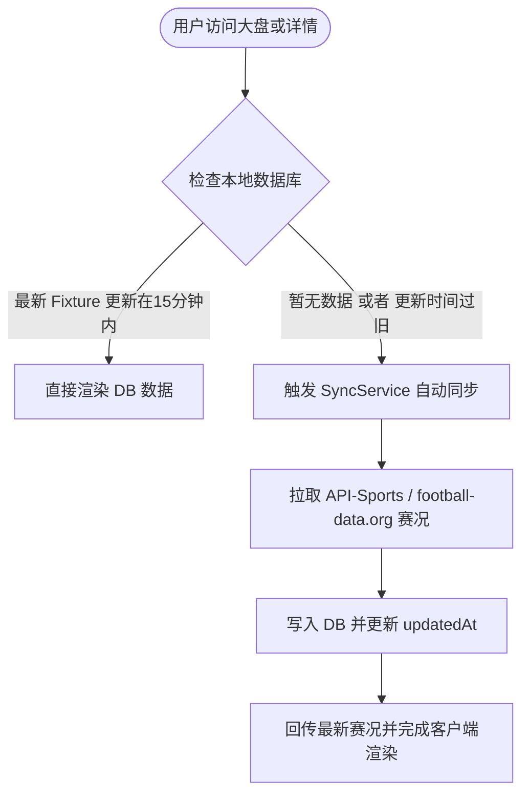

# PitchLab Soccer-Fintech TMA 项目架构与量化分析管道梳理

本项目是一款专为 2026 世界杯及顶级足球联赛打造的 **Soccer-Fintech（足球量化金融）模拟盘 Telegram Mini App (TMA)**。它不仅提供实时的赛程与赛况信息，更核心的是引入了金融量化分析模型（Dixon-Coles），将每场足球比赛像“金融资产”一样进行期望值（EV）与市场偏差（Edge）分析，为球迷和模拟盘玩家提供深度数据决策支持。

---

## 🛠 核心技术栈 (Technology Stack)

1. **前端与应用框架**：Next.js (App Router, React 18+)
2. **样式系统**：Tailwind CSS (定制的苹果 Light iOS 浅色极简微发光设计系统)
3. **数据库 & ORM**：Prisma ORM (支持 SQLite 开发环境与 PostgreSQL 生产环境)
4. **后台任务与同步**：Worker 定时状态机同步，Pinnacle 盘口赔率高频轮询管道
5. **Telegram TMA 集成**：支持 WebApp SDK 登录认证、群组/频道一键分享裂变、超级群（Supergroup）讨论話題 Topic 挂载

---

## 📂 模块与目录架构 (Directory Structure)

```
PitchLab/
├── apps/
│   ├── web/               # Next.js Telegram Mini App 主项目
│   │   ├── app/           # App Router 路由
│   │   │   ├── matches/   # 比赛详情路由（攻防波形图、3D球场、直播卡片、Markets）
│   │   │   ├── profile/   # 个人量化大本营（资产曲线、量化徽章、裂变邀请）
│   │   │   ├── standings/ # 积分、射手、助攻、纪律数据中心
│   │   │   ├── groups/    # 小组讨论 Circle（Topic 绑定映射）
│   │   │   └── page.tsx   # 根路由（主赛程大盘，包含 Upset & Sentiment 指数）
│   │   ├── components/    # 核心共享组件 (BottomNav, TeamFlag, DashboardClient 等)
│   │   └── lib/           # 客户端/服务端共用库（Prisma client 实例, 辅助函数）
│   │
│   └── worker/            # 后台 Worker 核心任务
│       ├── src/
│       │   ├── sync.ts    # 负责同步外部赛事元数据与比分结果
│       │   ├── align.ts   # 负责对齐和校准不同赔率数据源
│       │   └── notify.ts  # 负责 Telegram 频道 and 邮件的消息推送
│
├── prisma/                # 数据库定义与迁移脚本
│   ├── schema.prisma      # 包含 Fixture, Prediction, OddsSnapshot, Bet, User 等模型
│   └── seed.ts            # 系统基础数据和默认 Promotion Policy 播种脚本
│
└── public/
    └── data/
        ├── fixtures.json           # 官方基础赛程与分组白名单
        └── standings-scraped.json  # 球员射手/助攻/纪律备用静态抓取数据
```

---

## 🔄 数据同步与缓存管道 (Data Sync & Cache Pipeline)

项目为保持移动端极佳的无感加载，设计了**双通道数据保障机制**：



### 自动同步机制说明
在 [app/page.tsx](file:///Users/kaka/Dev/Oobs/PitchLab/apps/web/app/page.tsx) 和详情页中，我们通过检测 `latestFixture.updatedAt` 自动触发 `SyncService.syncDate(todayStr)`。此举实现了：
1. **零冷启动延迟**：常规访问直接读取本地超快速的 SQLite/PostgreSQL 数据。
2. **智能时效性**：在比赛日或者比赛进行中，只需一个用户访问，即可自动静默唤起后台 API 更新数据，省去繁重的轮询任务耗费 API 额度。
3. **安全容灾**：当外部 API 响应失败或超限时，会自动降级为加载本地 DB 或读取 `public/data/` 目录下的静态离线文件，确保 TMA 在弱网环境下仍然 100% 可用。

---

## 📈 Dixon-Coles 量化赔率模型与优势（Edge）计算

PitchLab 将足球概率学与博彩市场分析结合。核心公式计算如下：

### 1. 真实概率 (True Probability)
基于 Dixon-Coles 历史进球双变量泊松分布模型，算得主胜 ($P_H$)、平局 ($P_D$)、客胜 ($P_A$) 的“数学真值概率”。此数据保存在 `Prediction` 表的 `prob` 字段中。

### 2. Pinnacle 临场赔率 (Market Odds)
Worker 定时爬取全球最具风向标意义的 **Pinnacle（平博）** 实时 1X2 赔率，并将 snapshot 保存至 `OddsSnapshot` 中。

### 3. EV 与 期望优势 (Edge)
$$Edge = (True\ Probability \times Market\ Odds) - 1$$
当 $Edge > 0$ 时，说明市场赔率存在超额赔付风险（即“被低估”），系统会将此项高亮展示，供玩家在模拟盘中进行 EV 投注。

在 [BettingMarkets.tsx](file:///Users/kaka/Dev/Oobs/PitchLab/apps/web/app/matches/[id]/BettingMarkets.tsx) 中，我们为 Edge 设计了双向发光荧光能量条。如果 Edge 为正，代表有利可图，进度条将发出荧光绿色；若为负则为常规暗灰，将金融大盘的高级感与足球完美结合。

---

## 🎨 极具设计感的 UI 交互组件 (Premium UI Interactions)

1. **iOS 风格 Tab 弹性胶囊滑块**：
   在 [MatchDetailClient.tsx](file:///Users/kaka/Dev/Oobs/PitchLab/apps/web/app/matches/[id]/MatchDetailClient.tsx) 中，使用纯 CSS 与 React inline-style，利用 `cubic-bezier(0.25, 0.8, 0.25, 1.15)` 贝塞尔曲线平移绝对定位背景，实现极具物理回弹阻尼感的胶囊滑块。
2. **多语言 iOS 风格 Toast 浮层**：
   弃用廉价的原生 `alert()`。点击 FOX Sports, BBC Sport 等直播按钮时，由底层自定义 of React Toast 触发中英文双语流畅弹出提示，体验极佳。
3. **零体积 CSS Confetti 满屏粒子动效**：
   在比分预测 `Submit Prediction` 时，使用 40 个位置、大小、延时随机的 React 粒子，搭配 `@keyframes fallDown` 全屏彩屑下落帧动画，零依赖引入，保证极致的性能。
4. **攻防分时 SVG 波形图 (Attack Momentum Wave)**：
   提取比赛实时的 Goals、Red/Yellow Cards、Substitution 和重大威胁进攻事件的加权和，经过指数移动平均（EMA）平滑，生成 24 个节点的连续 SVG 攻防时空波形图，直观展现比赛局势倾斜度。
5. **3D Isometric 沙盘首发阵容**：
   在 [LineupsField.tsx](file:///Users/kaka/Dev/Oobs/PitchLab/apps/web/app/matches/[id]/LineupsField.tsx) 中，通过 CSS 3D 旋转（`rotateX(60deg) rotateZ(-10deg)`）构建带阴影的拟真绿色草坪三维沙盘，将球员阵型按 4-3-3 或 4-2-3-1 渲染在沙盘空间中，配以带发光外圈的球员评分头像框，比肩 EA Sports 的顶级视觉设计。

---

## 🗺️ 海外直播适配与 Telegram 超级群对接

### 1. 直播源双通道设计
- **Global Streams (海外精品源)**：针对海外华人及全球用户，提供 FOX Sports US, BBC Sport / iPlayer (UK TV), Telemundo Deportes (Spanish) 的高清信号。按钮带有 `⚡ Live` 闪烁绿灯。
- **Local Channels (国内主要转播源)**：针对国内常规访问，提供 CCTV-5, 咪咕视频等转播快捷通道。

### 2. 小组 Topic 话题映射 (方案 A)
在 [groups/page.tsx](file:///Users/kaka/Dev/Oobs/PitchLab/apps/web/app/groups/page.tsx) 中，建立 Telegram Supergroup 的 `Topic ID` 双向映射。进入不同小组讨论区，将根据 Topic ID 自动唤起 Telegram 对应小组话题讨论线，避免了为单场比赛创建上百个临时群组所带来的管理混乱。

---

## 🛠 开发与部署验证规范

1. **静态代码校验**：在 `apps/web` 目录下执行 `npx tsc --noEmit` 进行 TypeScript 类型严格校验。
2. **生产打包构建**：在根目录下执行 `npm run build -w pitchlab-web` 进行生产环境构建。所有的 SSR 页面和 SSG 页面生成不能有任何类型或运行时 Hydration 冲突。
