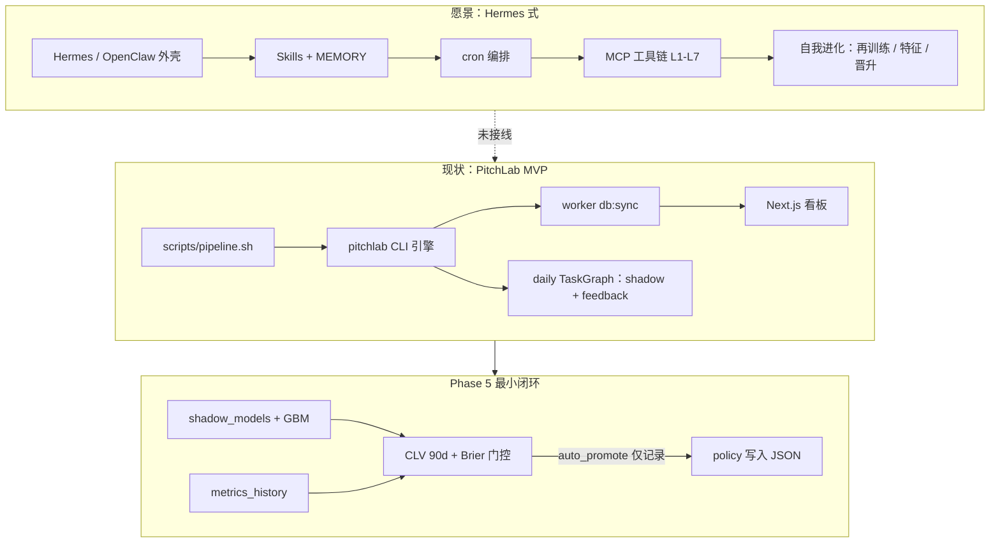
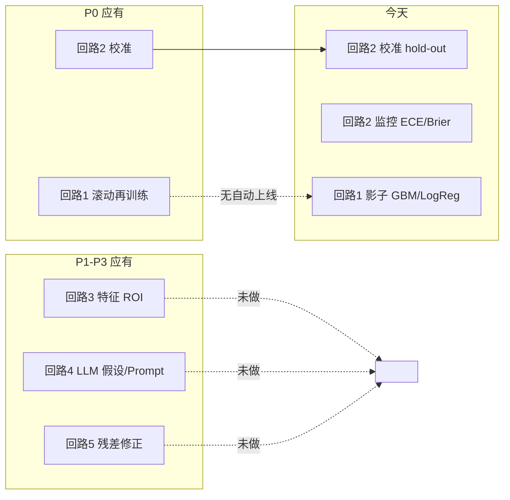
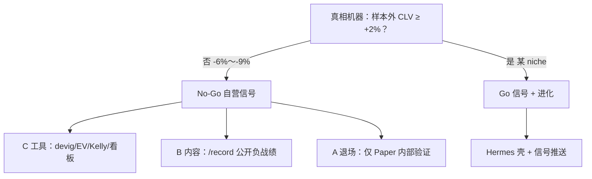
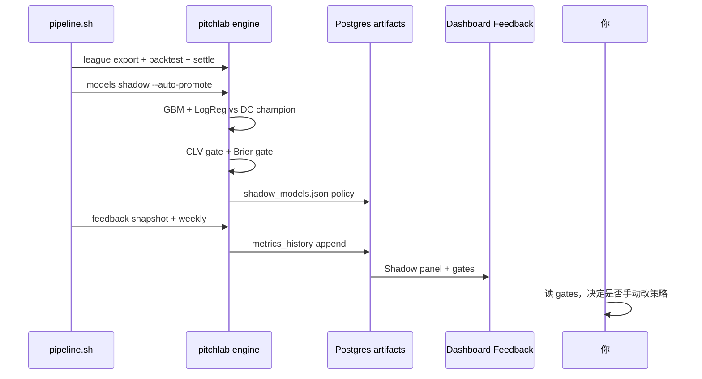
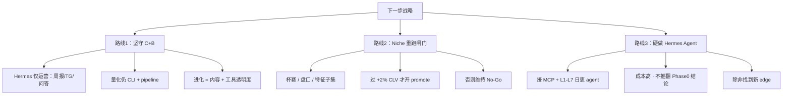

# PitchLab：愿景 vs 现状 vs Phase 5 最小闭环

> 单页对照 · 2026-06-03 · 与 `research/00-decisions.md`、`research/14-phase0-go-nogo.md` 一致

---

## 1. 一句话

| | |
|---|---|
| **原始意图** | Hermes 式外壳 + 足球量化 L1–L7 + **可证伪进化**（CLV 闸门） |
| **Phase 0 结论** | 主流联赛 1X2 **无样本外 +CLV** → **No-Go 自营信号** |
| **今天是什么** | **C 量化研究台 + B 透明内容**；Agent 为**日批监控**，非自主进化体 |
| **Phase 5 最小闭环** | 监控 → 闸门 → **记录**（可选武装 promote，仍不自动改生产） |

---

## 2. 三层架构对照

---

## 3. 七层流水线：设计 vs 实现度

| 层 | 设计职责 | 实现度 | 代码/产物 |
|----|----------|--------|-----------|
| **L1** 采集 | 赛程、赔率、赛果 | 🟡 部分 | `fixtures --live`、football-data.co.uk、settlements |
| **L2** 清洗 | 统一 Match schema | 🟢 | `pitchlab/data/schema.py` |
| **L3** 特征 | Elo、xG、文本 | 🟡 | Elo ✅ · Understat/LLM 文本 ⬜ |
| **L4** 预测 | DC / 校准 | 🟢 | `league export`、`worldcup` |
| **L5** 策略 | devig、+EV | 🟢 分析用 | `value.json`、Value tab |
| **L6** 资金 | Kelly 建议 | 🟢 建议 only | Paper ¼-Kelly、`staking.py` |
| **L7** 反馈 | CLV/ROI/Brier → 进化 | 🟡 **监控** | feedback_snapshot、shadow、**无生产晋升** |

图例：🟢 可用 · 🟡 部分/监控 only · ⬜ 未做

---

## 4. 「自我进化」在文档里的五条回路

| 回路 | 目标 | 状态 |
|------|------|------|
| 1 滚动再训练 | 周期重训 → **切换生产模型** | 仅 shadow 评估 + `--auto-promote` 门控（默认不触发） |
| 2 校准 | isotonic / 监控 Brier | ✅ hold-out + metrics_monitor |
| 3 特征 ROI | 特征贡献闭环 | ⬜ |
| 4 LLM 假设 | 文本特征、Prompt A/B | ⬜ |
| 5 残差修正 | 有护栏 LLM 微调概率 | ⬜ |

---

## 5. Phase 0 如何改变产品形态

**当前代码路径走的是左侧（No-Go）**——这不是 MVP 偷懒，而是**有数据支撑的 pivot**。

---

## 6. Phase 5「最小闭环」定义（可验收、不夸大）

目标：**在不动 Hermes 的前提下**，把「进化」做成**可审计的监控环**，而不是自动荐彩。

### 验收清单（Phase 5 minimal ✅ / ⬜）

| # | 项 | 状态 |
|---|-----|------|
| 1 | 每日 shadow 对比（DC cal vs raw + ML） | ✅ |
| 2 | GBM challenger（Elo 特征） | ✅ |
| 3 | metrics_history 滚动 | ✅ |
| 4 | CLV + Brier 门控写入 `policy` | ✅ |
| 5 | `--auto-promote` 武装（非默认开启） | ✅ |
| 6 | promote 后**写回**生产 `model_version` | ⬜ |
| 7 | 滚动再训练**自动**替换 champion | ⬜ |
| 8 | Hermes MCP 调用 `pitchlab` | ⬜ |

---

## 7. 三条路线（决策树）

| 路线 | 与 Hermes 愿景距离 | 与 Phase 0 一致性 | 推荐 |
|------|-------------------|-------------------|------|
| **1 C+B + Hermes 运营壳** | 中（外壳像，内核不赌） | ✅ 高 | **默认推荐** |
| **2 Niche 再证伪** | 低→高（仅 niche 有信号时） | ✅ 需新实验 | 有研究方向时 |
| **3 全栈自主 Agent** | 高 | ⚠️ 易与 No-Go 冲突 | 仅当 2 成功 |

---

## 8. 关键文件索引

| 主题 | 路径 |
|------|------|
| 锁定决策 | `research/00-decisions.md` |
| Go/No-Go | `research/14-phase0-go-nogo.md` |
| Agent 自动化设想 | `research/06-agent-automation.md` |
| 日批 Agent | `engine/pitchlab/agent/pipelines/daily.py` |
| Shadow + 门控 | `engine/pitchlab/models/shadow.py`, `promotion.py` |
| 公开战绩 | `apps/web/app/record/page.tsx` |
| 路线图 | `docs/roadmap.md`, `docs/next-steps.md` |

---

## 9. 给协作者的一句话版本

> PitchLab **已经**是「足球版量化研究台 + 诚实战绩内容」；**还没有**是「会自己变强并替你下注的 Hermes」。  
> Phase 0 用 CLV 关掉了主流自营信号；Phase 5 应把进化做成**可审计监控**，而不是假装已有 alpha。  
> 若要坚持 Hermes 愿景，优先 **路线 1（运营壳）** 或 **路线 2（niche 重跑闸门）**，避免在已证伪的主战场上硬做自主荐彩。
